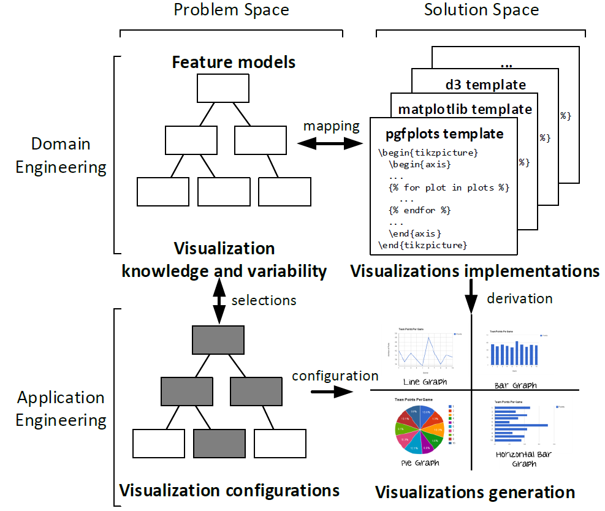

# Table of Contents
- [Table of Contents](#table-of-contents)
- [Variability in Data Visualization: a Software Product Line Approach](#variability-in-data-visualization-a-software-product-line-approach)
  - [Artifact description](#artifact-description)
  - [How to use it](#how-to-use-it)
    - [Requirements](#requirements)
    - [Download and install](#download-and-install)
    - [Execution](#execution)
    - [Results output](#results-output)
  - [Validation replication](#validation-replication)
  - [References and third-party software](#references-and-third-party-software)

# Variability in Data Visualization: a Software Product Line Approach
This repository contains all the resources and artifacts that support the paper entitled "Variability in Data Visualization: a Software Product Line Approach" submmited to the 26th International Systems and Software Product Line Conference (SPLC 2022).

## Artifact description
An implementation of the *software product line* (SPL) for the *visualization design process* (VDP) that allows generating customized visualizations following the best design practices in data visualization.
It contains the following resources classified according to the SPL processes:

- **DOMAIN ENGINEERING**:
  - The [**feature models**](feature_models/) in the [UVL](https://github.com/Universal-Variability-Language) and [FeatureIDE](https://www.featureide.de/) formats that encode the variability of the VDP and knowledge abour best design practices. Concretely, there are four feature models, one for each step in the VDP:
    1. Step 1: Determine the information you need to display.
    2. Step 2: Select the best means to display the information.
    3. Step 3: Design the display to show the information simply, clearly, and accurately.
    4. Step 4: Select the implementation for the visualization.
  - The [**visualization templates**](templates/) that implement the variability of the visualization artifact. The templates rely on the [Jinja2]() engine to resolve the variability and generate the final visualization code. Currently, we provide the template for *Latex* using the *pgfplots* and *tikz* packages.
  - The [**mapping models**](mapping_models/) that map the features in the feature model with the visualization templates. Currently, we provide the mapping model for the *Latex* template using the *pgfplots* and *tikz* packages.
- **APPLICATION ENGINEERING**:
  - The [**configurations**](validation/configurations/) of the feature models to generate the visualizations of the four practical scenarios described in the paper. The configurations includes two kinds of files:
    - Configurations of the feature models generated with FeatureIDE (.xml). There is at least one configuration for each of the four feature models, and additional configurations for the feature models of Step 3 for each different dataset (i.e., due to the existing multi-feature or clonable feature in the third feature model).
    - Configurations of the feature attributes (.csv). There is one file for general attributes in feature model of Step 3, as well as one file each different dataset (i.e., due to the existing multi-feature or clonable feature in the third feature model).
  - The [**Python scripts**](main.py) to orchestrate the all the previous resources and resolve the variability using the Jinj2 template engine.

Additionally, we provide the following resources to replicate the visualizations used in the validation:
  - The [FeatureIDE projects](validation/FeatureIDEprojects/) with the feature models and configurations to easy their inspection and editing.
  - The [quantitative data](validation/data_resources/) with the .csv files containing the raw data for the visualization.
  - The [generated visualizations](validation/generated_visualizations/) with our SPL, as well as the adapted visualizations containing the manual modifications to the generated visualizations to fit them in the final paper.

## How to use it

### Requirements
- [Python 3.9+](https://www.python.org/) to execute the SPL and generate a visualization.
- [FeatureIDE](https://www.featureide.de/), only in case you want to create new configurations for other visualizations.

### Download and install
To use the SPL follow the next steps:
1. Install [Python 3.9+](https://www.python.org/)
2. Download this repository and enter into the main directory: 

   `cd spl_visualization_design` 
3. Create a virtual environment: 
   
   `python -m venv env`
4. Activate the environment: 
   
   In Linux: `source env/bin/activate`

   In Windows: `.\env\Scripts\Activate`
5. Install the dependencies: 
   
   `pip install -r requirements.txt`

### Execution
To execute the SPL run the following command:

   `python  main.py -f <folder with the configurations>`

  where the parameter `-f` indicates the directory that contains all configurations (configurations of feature models and attributes files) for a specific scenario.
  See the examples below to replicate the experiments of the paper.

### Results output
The scripts generate the visualization in the main directory with the source code of the visualization in *Latex* using the *pgfplots* and *tikz* packages.
The scripts also print out in the terminal information about the process including:ç
- The configurations (.xml) found in the directory and considered in the SPL.
- The attributes files (.csv) found in the directory and considered in the SPL.
- The mapping model used.
- Template configuration with the variability resolved.

## Validation replication
To replicate the experiments of the paper and generate the visualizations run the following commands:

1. Scenario 1: `python main.py -f validation/configurations/scenario1`
2. Scenario 2: `python main.py -f validation/configurations/scenario2`
3. Scenario 3: `python main.py -f validation/configurations/scenario3`
4. Scenario 4: `python main.py -f validation/configurations/scenario4`

In all cases, a `visualization.tex` file is generated in the main directory with the source code of the visualization in *Latex* using the *pgfplots* and *tikz* packages.

In the [Validation folder](validation/) you can find all the resources, including the data files and the generated visualizations.

## References and third-party software
- [Python framework for automated analysis of feature models](https://github.com/diverso-lab/core)
- [FeatureIDE](https://www.featureide.de/)
- [UVL](https://github.com/Universal-Variability-Language)